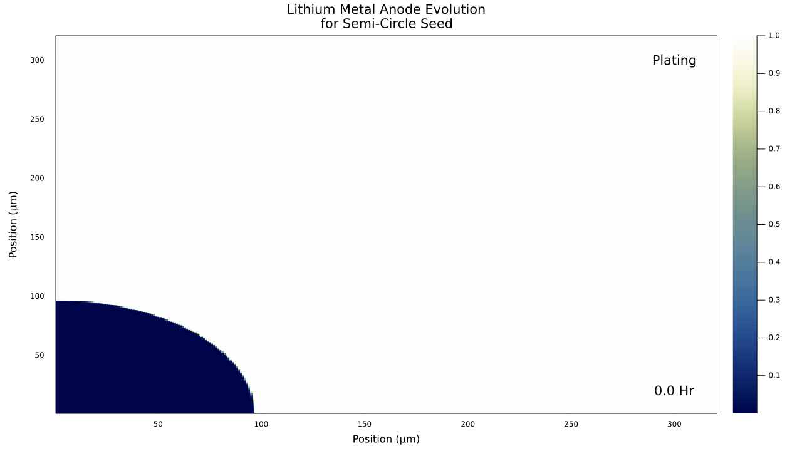

# BattPhase.jl

[](https://bradyplanden.github.io/LiMetalPhaseFields.jl/stable)
[](https://bradyplanden.github.io/LiMetalPhaseFields.jl/dev)
[](https://github.com/bradyplanden/LiMetalPhaseFields.jl/actions/workflows/CI.yml?query=branch%3Amain)
[](https://codecov.io/gh/bradyplanden/LiMetalPhaseFields.jl)

BattPhase.jl provides a Julia framework for solving lithium-metal 2D phase field problems. This work is presented to support this pre-print: [10.1149/osf.io/k2vu6]

&nbsp;

Install (Julia 1.7 and later)
-----------------------------

```julia
(v1.7) pkg> add https://github.com/BradyPlanden/BattPhase.jl
```

(Type `]` to enter package mode.)

<!-- &nbsp;
## Examples 
Run the semi-circle example via,
```julia
include("examples/Semi-example.jl")
```
-->

&nbsp;
## Results
<p align="center">

</p>

[10.1149/osf.io/k2vu6]: https://ecsarxiv.org/k2vu6/
