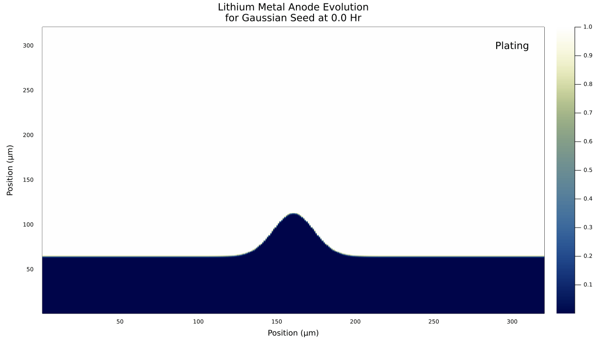

# BattPhase.jl

[](https://bradyplanden.github.io/LiMetalPhaseFields.jl/stable)
[](https://bradyplanden.github.io/LiMetalPhaseFields.jl/dev)
[](https://github.com/bradyplanden/LiMetalPhaseFields.jl/actions/workflows/CI.yml?query=branch%3Amain)
[](https://codecov.io/gh/bradyplanden/LiMetalPhaseFields.jl)

BattPhase.jl provides a Julia framework for solving lithium-metal 2D phase field problems. This work is presented to support pre-print: [10.1149/osf.io/k2vu6]

&nbsp;

Install (Julia 1.7 and later)
-----------------------------

```julia
(v1.7) pkg> add https://github.com/BradyPlanden/BattPhase.jl
```

(Type `]` to enter package mode.)

<!-- &nbsp;
## Examples 
Run the semi-circle example via,
```julia
include("examples/Semi-example.jl")
```
-->

&nbsp;
## Results
The following results have been obtained utilising Julia 1.7.2, with `Threads.nthreads() = 1` and Pardiso.jl utilised for LinearAlgebra. Benchmark hardware was a 10980XE with 64Gb of memory. Visual results from the included `Semi-Circle` example are shown below,


<p align="center">

</p>


The following table includes the median result for 7 benchmark samples up to 320<sup>2</sup>. Results above 320<sup>2</sup> currently include 2 samples with a mean shown. Three significant figures are presented.
&nbsp;
## Code Timing - Upwind Scheme

<div align="center">
  
|Number of Node Points|Runge-Kutta 3 |Runge-Kutta 3 Approximation|
|:-:|:-:|:-:|
| 10<sup>2</sup>  |  5.86 ms | 2.02 ms  |
|  20<sup>2</sup> | 46.7 ms  | 15.6 ms  |
|  40<sup>2</sup>|  262 ms | 87.7 ms |
|  80<sup>2</sup>| 1.58 s | 532 ms|
|  160<sup>2</sup> |  13.4 s | 4.57 s |
|  320<sup>2</sup> |  121 s| 41.1 s|
|  640<sup>2</sup> |  953 s| 315 s|
  
</div>


[10.1149/osf.io/k2vu6]: https://ecsarxiv.org/k2vu6/
